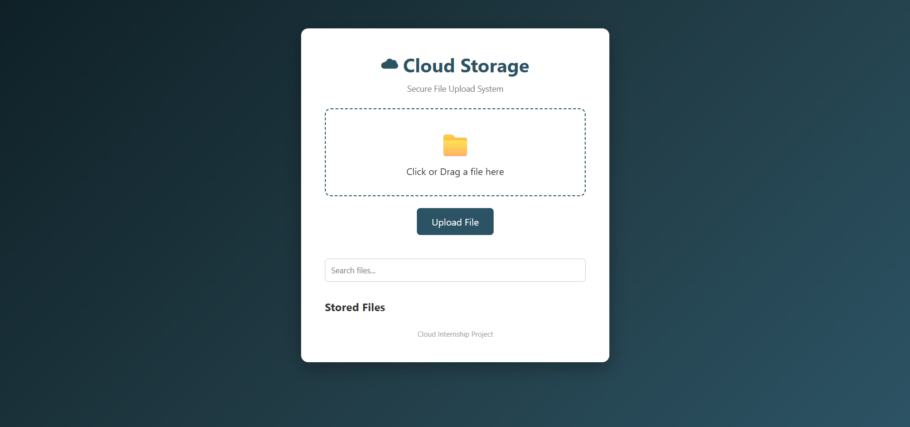
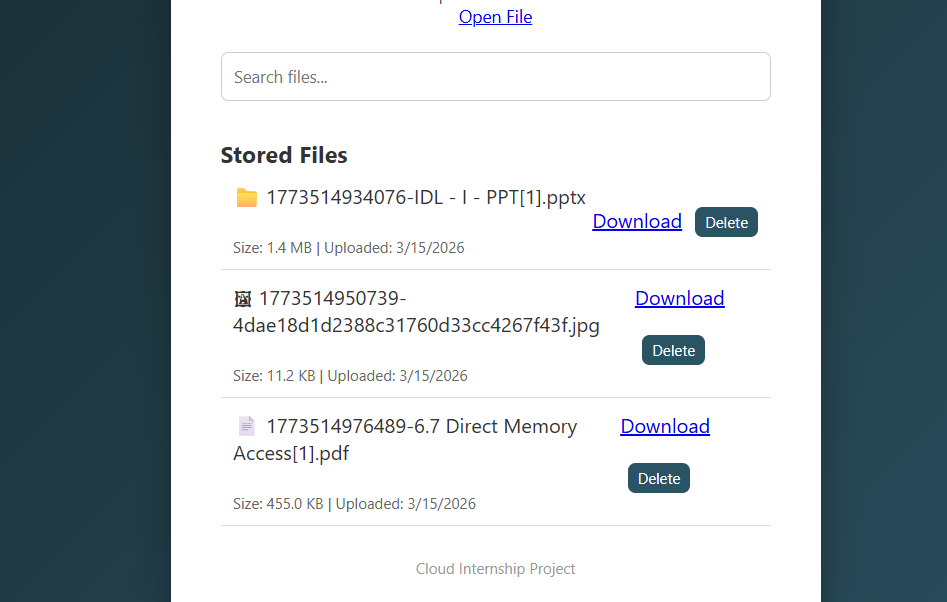
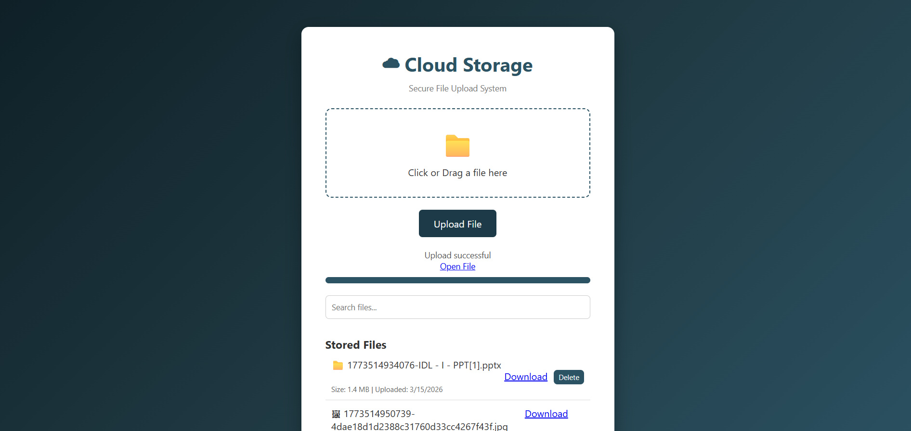

# Cloud Storage System using AWS S3

## Project Overview

This project is a cloud-based file storage system that allows users to upload, manage, download, and delete files using AWS S3 as the storage backend.

The application provides a simple web interface where users can drag and drop files to upload them to cloud storage. The backend is built with Node.js and Express, and it communicates with AWS S3 using the AWS SDK.

This project demonstrates how cloud storage systems work using modern web technologies.

---

## Features

• Upload files to AWS S3
• Drag and drop file upload
• Upload progress bar
• Display file size
• Display upload date
• Search uploaded files
• Download files
• Delete files from cloud storage

---

## Technologies Used

### Frontend

HTML
CSS
JavaScript

### Backend

Node.js
Express.js

### Cloud Platform

Amazon Web Services (AWS S3)

### Libraries Used

multer – for file uploads
aws-sdk – to connect with AWS S3
cors – enable API access from frontend
dotenv – manage environment variables

---

## Project Architecture

User Browser
↓
Frontend (HTML + JavaScript)
↓
Node.js Express API
↓
AWS SDK
↓
AWS S3 Bucket

---

## Folder Structure

cloud-storage-project
│
├── server.js
├── package.json
├── package-lock.json
├── .env
│
├── frontend
│   └── index.html
│
└── node_modules

---

## How to Run the Project

Step 1 — Install Node.js

Download Node.js from:
https://nodejs.org

---

Step 2 — Install dependencies

Open terminal in project folder and run:

npm install

---

Step 3 — Configure Environment Variables

Create a `.env` file and add your AWS credentials:

AWS_ACCESS_KEY=your_access_key
AWS_SECRET_KEY=your_secret_key
AWS_REGION=ap-south-1
S3_BUCKET=your_bucket_name

---

Step 4 — Start the server

node server.js

Server will run at:

http://localhost:3000

---

Step 5 — Open the frontend

Open the file:

frontend/index.html

in your browser.

---

## Example Workflow

1. User selects or drags a file.
2. The file is sent to the backend using an API request.
3. The backend uploads the file to AWS S3.
4. The frontend displays uploaded files with metadata.
5. Users can download or delete files.

---

## Learning Outcomes

Through this project I learned:

• How to build REST APIs using Node.js
• How to upload files using multer
• How to integrate AWS S3 cloud storage
• How frontend and backend communicate
• How cloud-based file storage systems work

---
## Screenshots

### Upload Interface

### Stored Files

### Upload Progress

## Author

Surya P
B.Tech Information Technology
Cloud Computing Internship Project
